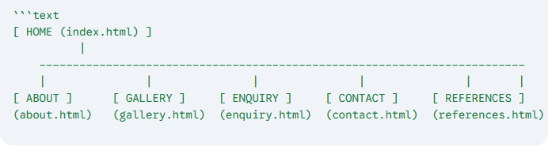

# Project Title: Luxwynne Fashion House

## Student Information
**Student number:** st10537126  
**Student Name:** Joshua Ofentse Olu  
**Module:** WEDE5020  

---**Live Deployment URL:** [Click Here to gaze upon my Live Website](https://6a359503e5c27299c7b99497--singular-taffy-6dd84c.netlify.app/)

## Project Overview
Luxwynne is a high-end luxury streetwear brand blending Y2K aesthetic influences with modern minimalist design. This website prototype establishes a "Luxury Black and Gold" color palette to create an exclusive, boutique feel. The interface features an ultra-clean, high-fashion editorial portal layout inspired by elite minimalist corporate design houses like Balenciaga. The project focuses on high-impact typography, semantic HTML5 structure, and clean responsive grids to cleanly showcase the brand's core capsule pieces.

---

## Website Goals and Objectives
* **Establish Brand Identity:** Create a visual language using custom CSS rules that cleanly communicates luxury, architectural structure, and exclusivity.
* **User Experience:** Provide a stark, distraction-free, easy-to-navigate desktop interface for users to inspect the lookbook collection.
* **Responsive Structure:** Ensure layout consistency across variable monitor dimensions using semantic HTML5 tags and clean CSS Flexbox properties.
* **Interactive Design:** Implement a custom JavaScript animation layer alongside fully functional navigation frameworks to simulate a premium e-commerce portal environment.

---

## Timeline and Milestones
* **Milestone 1:** Brand identity conceptualization and color palette standardization (Deep Charcoal Black, Milled Gold, and Soft Industrial White).
* **Milestone 2:** Development of the complete 6-page HTML structure consisting of index.html, about.html, gallery.html, enquiry.html, contact.html, and references.html.
* **Milestone 3:** Implementation of global CSS layout constraints, typography rules, and interactive hover-driven particle effects.
* **Milestone 4:** Asset integration (AI-assisted product imagery), resolving directory relative pathing discrepancies, and compiling deployment markdown logs.

---

## Sitemap


---

## Complete Directory Architecture
```text
luxwynne-project/
│
├── index.html
├── about.html
├── gallery.html
├── enquiry.html
├── contact.html
├── references.html
│
├── css/
│   └── style.css
│
├── js/
│   └── animations.js
│
└── img/
    ├── mysitemap.png
    ├── newschool.png
    ├── y2k.png
    └── retro.png
Development Diary & Technical Notes
The development process involved several technical challenges that were vital to shaping the final output:

Initial Scaffolding: Used native semantic HTML5 structural tags (, , , ) to ensure high baseline accessibility and document clarity.

Architecture Struggle: Encountered issues with relative asset path parsing during initial routing setup. Resolved by cleanly mapping all product resources into an insulated /img/ directory to match standard local path criteria.

Naming Conflicts: Debugged a critical asset rendering block where image files were mislabeled with double extensions (e.g., .png.png). Synchronized the naming format to guarantee clean rendering across the gallery grid.

Layout Constraints & Styling: Utilized CSS Flexbox and an auto-fitting grid architecture to space elements across expanded 1400px desktop containers. Avoided external styling frameworks to demonstrate a core understanding of the CSS Box Model, positioning states, and typography hierarchies.

Interactive JavaScript System: Integrated an external script (js/animations.js) that tracks page intersection bounds and binds to interactive elements—spawning ambient gold sparkle trail arrays upon user hover states.

AI Assistance: Generative AI tools (ChatGPT, Gemini, and Botika) were utilized to formulate thematic, high-density product imagery assets, assist with responsive layout code debugging, and structurally organize formal technical documentation files.

References (IIE Harvard Format)
Adobe Color. (2026). Color wheel, color palette generator. [Online]. Available at: https://color.adobe.com/explore [Accessed 13 April 2026].

Botika. (2026). AI Fashion Model Generation. [Online AI Tool]. Available at: https://www.botika.io/ [Accessed 18 April 2026].

Codecademy. (2021). Learn HTML. [Online]. Available at: https://www.codecademy.com/learn/learn-html [Accessed 07 February 2023].

Dani Krossing. (2017). How do we include CSS in our HTML. [YouTube Video]. Available at: https://youtu.be/YNSnugnQYil [Accessed 07 February 2023].

Dev Dreamer. (2018). CSS Understanding the Cascade. [YouTube Video]. Available at: https://youtu.be/NP8USarU6X0 [Accessed 07 February 2023].

Google Gemini. (2026). Generative AI assistance for HTML structure and project documentation. [Online AI Tool]. Available at: https://gemini.google.com/ [Accessed 19 April 2026].

Jen Simmons. (2020). HTML Essential Training. [LinkedIn Learning]. Available at: https://www.linkedin.com/learning/html-essential-training-4/what-is-html?u=57119457 [Accessed 07 February 2023].

MDN Web Docs. (2026). HTML5 semantic elements. [Online]. Available at: https://developer.mozilla.org/en-US/docs/Glossary/Semantics#semantics_in_html [Accessed 16 April 2026].

Mr. Virk Media. (2019). What is DOM? HTML DOM Diagram and Explanation. [YouTube Video]. Available at: https://youtu.be/RbQGn6vBlys [Accessed 07 February 2023].

OpenAI. (2026). ChatGPT: Generative AI for code debugging and logic. [Online AI Tool]. Available at: https://chatgpt.com/ [Accessed 19 May 2026].

Richard Swearingen. (2020). Validating Code with the W3C Validator. [YouTube Video]. Available at: https://youtu.be/XaED7vEN1Ss [Accessed 07 February 2023].

Simplilearn. (2020). HTML In 10 Minutes | HTML Tutorial for Beginners. [YouTube Video]. Available at: https://youtu.be/MDLn5-zSQQI [Accessed 07 February 2023].

Steve Griffith - Prof3ssorSt3v3. (2018). Whitespace in HTML. [YouTube Video]. Available at: https://youtu.be/XhltAZTTSR8 [Accessed 07 February 2023].

The Net Ninja. (2019). Chrome Dev Tools. [YouTube Video]. Available at: https://youtu.be/25R1JI5P7Mw [Accessed 07 February 2023].

Tutorials Point (India) Ltd. (2018). HTML5 – Basic Syntax. [YouTube Video]. Available at: https://youtu.be/SmPW4dZuaJY [Accessed 07 February 2023].

W3C. (2026). W3C Markup Validation Service. [Online]. Available at: https://validator.w3.org/ [Accessed 19 June 2026].

W3Schools. (2021). Learn HTML. [Online]. Available at: https://www.w3schools.com/html/default.asp [Accessed 07 February 2023].

W3Schools. (2026). HTML5 Introduction. [Online]. Available at: https://www.w3schools.com/html/html_intro.asp [Accessed 14 April 2026].

Web Dev Simplified. (2019). Learn CSS Box Model in 8 Minutes. [YouTube Video]. Available at: https://youtu.be/rlO5326FgPE [Accessed 07 February 2023].

Web Dev Simplified. (2019). Learn CSS Position in 9 Minutes. [YouTube Video]. Available at: https://youtu.be/jx5jml0UIXU [Accessed 07 February 2023].

Xoaxdotnet. (2020). HTML Lesson 27: Deprecated Elements. [YouTube Video]. Available at: https://youtu.be/hk4ppR0m4Os [Accessed 07 February 2023].

Yusuf Shakeel. (2017). HTML | Block and Inline elements #10. [YouTube Video]. Available at: https://youtu.be/d-aWbEn3An4 [Accessed 07 February 2023].
